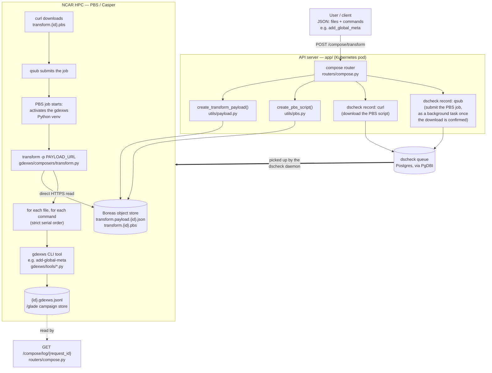

# Architecture

This document describes how a data curation request flows through `gdex-web-services`, and how the two Python packages in this repo — the API server (`app/`) and the HPC execution package (`gdexws/`) — are each organized by separation of concern.

See the [main README](README.md) for install/run/deploy instructions.

## 1. End-to-end workflow

A curation task (e.g. "add a global attribute to this NetCDF file") crosses three execution boundaries: the API server (Kubernetes), the GDEX job queue (`dscheck` / Postgres), and NCAR HPC (PBS/Casper). The API server never touches the data files directly — it only ever composes a payload + PBS script and hands off execution to HPC via `dscheck`.



Walkthrough:

1. **User submits a curation task** as a single JSON request — a list of relative `Files` plus a list of `Commands` (each a `command` name and its parameters), validated against the `TransformRequest` schema.
2. **API server receives the request** at `POST /compose/transform` and generates a `request_id` (UUID) used to name every artifact for this job and to name its log file.
3. **API composes the payload and PBS script**: the request is serialized to a JSON payload and a PBS script is templated around it; both are uploaded to the Boreas object store (S3-compatible), keyed by `request_id`, so the HPC side only ever needs a URL.
4. **API talks to `dscheck`** (the GDEX job queue, via `rda_python_common`) to schedule two steps on HPC: first a `curl` to download the PBS script, then — as a background task that polls until the script actually exists on disk (avoiding a race) — a `qsub` to submit it. Everything up to this point runs on the API server; the response returned to the user carries the `cindex`/`request_id` needed to poll status.
5. **HPC executes the job**: once `dscheck` runs the queued `qsub`, PBS starts the job, which activates the `gdexws` virtualenv already installed on HPC and runs `transform -p <payload_url>`, reading the payload directly from its Boreas URL — no shared filesystem hand-off is needed between the API server and HPC.
6. **`transform` runs the payload serially**: for each file, for each command (in the order given), it shells out to the corresponding `gdexws` CLI tool. Any non-zero exit aborts the job. Every step — including PBS shell start/end markers — is appended as one JSON line to `{request_id}.gdexws.jsonl` on the shared `/glade` campaign store, which `GET /compose/log/{request_id}` reads back to report job progress to the user. `GET /compose/status/{cindex}` reports the separate, queue-level `dscheck` record status (queued/running/etc.) and does not read this file.

## 2. API server (`app/`)

FastAPI application. Its job stops at *composing and dispatching* work — it never runs a curation command itself. It is organized as thin transport, isolated schemas, and single-purpose integration utilities:

```
app/
├── main.py                 # FastAPI app assembly — wires routers together
├── routers/                # HTTP layer: request/response only, no business logic
│   ├── compose.py          #   POST /compose/transform, GET /compose/status, /log, /health
│   ├── datasets.py         #   dataset listing/metadata endpoints
│   ├── files.py            #   file format sniffing, metadata preview, access checks
│   └── generators.py       #   NetCDF variable plot -> PNG, uploaded to object store
├── schemas/
│   └── models.py           #   Pydantic models (TransformRequest, Command) + input validation
└── utils/                  # integration/business logic, one concern per module
    ├── boreas.py            #   boto3 S3 client factory for the Boreas object store
    ├── payload.py           #   builds + uploads the transform JSON payload
    ├── pbs.py               #   templates + uploads the PBS job script
    ├── dscheck_json.py       #   reads dscheck records + tails job JSONL logs into a standard response shape
    └── file_validation.py    #   relative-path containment check (defense against path traversal)
```

**Separation of concerns:**

| Layer | Responsibility | Depends on |
|---|---|---|
| `routers/` | Parse HTTP requests, call `utils/`, shape HTTP responses. No file I/O, no PBS/S3 knowledge. | `schemas/`, `utils/` |
| `schemas/` | Define and validate the wire format (`TransformRequest`/`Command`). Rejects absolute paths and `..` traversal before any handler logic runs. | — |
| `utils/` | Each module owns exactly one external integration: Boreas/S3 (`boreas.py`), payload construction (`payload.py`), PBS script construction (`pbs.py`), or `dscheck`/log status (`dscheck_json.py`). | `schemas/` (payload only) |

`routers/compose.py` is the only place that talks to `dscheck` (via `rda_python_common`'s `PgDBI`/`PgLOG`) — that dependency is intentionally not pushed down into `utils/`, since submitting/tracking jobs is a routing-level concern (it decides *when* to enqueue), while `utils/` only knows how to *build* the artifacts a job needs.

`routers/files.py` and `routers/generators.py` are self-contained, read-only conveniences (format sniffing, plotting) that don't go through the `compose` → `dscheck` → HPC pipeline at all — they run entirely inside the API pod.

## 3. HPC execution package (`gdexws/`)

Installed as a Python package directly on HPC (`pip install .`) and executed there by the PBS job. It is organized as one orchestrator, many single-purpose tools, and shared low-level helpers:

```
gdexws/
├── composers/
│   └── transform.py        # orchestrator: loads the payload, drives the serial file x command loop
├── tools/
│   └── add_global_meta.py  # one curation operation per module; each is its own CLI
├── utils/
│   ├── parse_payload.py    #   load_payload (file/URL), build_command, execute_command (subprocess)
│   ├── file_validation.py  #   relative-path containment check (re-validated at execution time)
│   └── logging.py          #   service_log / log_format — the JSONL structured-log format
├── pbs/
│   └── transform.pbs       # reference PBS script template (superseded per-job by utils/pbs.py's generated version)
└── pyproject.toml          # registers CLI entry points: `transform`, `add-global-meta`, ...
```

**Separation of concerns:**

| Layer | Responsibility | Depends on |
|---|---|---|
| `composers/` | Orchestration only: read `Files`/`Commands` from the payload, translate each command dict into a CLI invocation, run them in order, stop on first failure. Knows nothing about *what* any individual command does. | `utils/` |
| `tools/` | One curation operation per module (e.g. `add_global_meta.py`), each with its own `argparse` CLI and its own entry point in `pyproject.toml`. Adding a new curation capability means adding a new file here, not touching the composer. | `utils/` |
| `utils/` | Shared, low-level helpers with no orchestration or curation logic of their own: payload loading (`parse_payload.py`), path safety (`file_validation.py`), and the structured JSONL log format (`logging.py`) every command/composer writes through. | — |

`composers/transform.py` never imports a tool module directly — it calls tools the same way a human would, as subprocesses via `build_command`/`execute_command`, using the CLI names registered in `pyproject.toml` (`project.scripts`). This keeps the composer decoupled from any given tool's Python API and means the payload's `"command": "add_global_meta"` maps 1:1 onto an installed CLI (`add-global-meta`), not a Python import path.

## 4. Cross-cutting notes

- **Path validation is duplicated on purpose.** `app/utils/file_validation.py` (API server) and `gdexws/utils/file_validation.py` (HPC) implement the same relative-path containment check independently, in two different processes/environments. The API layer validates early (fail fast, before any HPC resources are spent); `gdexws` re-validates at execution time because it is the component actually opening files, and it must not trust an upstream payload (e.g. a hand-crafted one, or a URL) it didn't itself construct.
- **`request_id` vs `cindex`.** The API server mints a `request_id` (UUID) to name payload/PBS/log artifacts before any `dscheck` record exists; `dscheck` then assigns its own integer `cindex` per queued step (download, submit). Both identifiers are threaded through so a client can poll either `GET /compose/status/{cindex}` (dscheck state) or `GET /compose/log/{request_id}` (job's own JSONL progress).
- **Two log formats, two purposes — kept fully separate.** `gdexws/utils/logging.py` (`service_log`/`log_format`) defines the *JSONL line format* written by the running job on HPC — `command`, `time_of_process`, `level`, `process_message`, plus free-form kwargs — one line per log call, appended to `{request_id}.gdexws.jsonl`. `app/utils/dscheck_json.py` (`get_dscheck_json`) defines the unrelated *API status envelope* — `cindex`, `time_of_status`, `command`, `argv`, `specialist`, `issuer`, `status_message` — built entirely from the `dscheck` DB record, with no read of the JSONL file. The two are queried through different endpoints for different questions: `GET /compose/status/{cindex}` answers "where is this job in the `dscheck` queue?"; `GET /compose/log/{request_id}` answers "what has the job itself reported?" by returning the raw JSONL entries.
